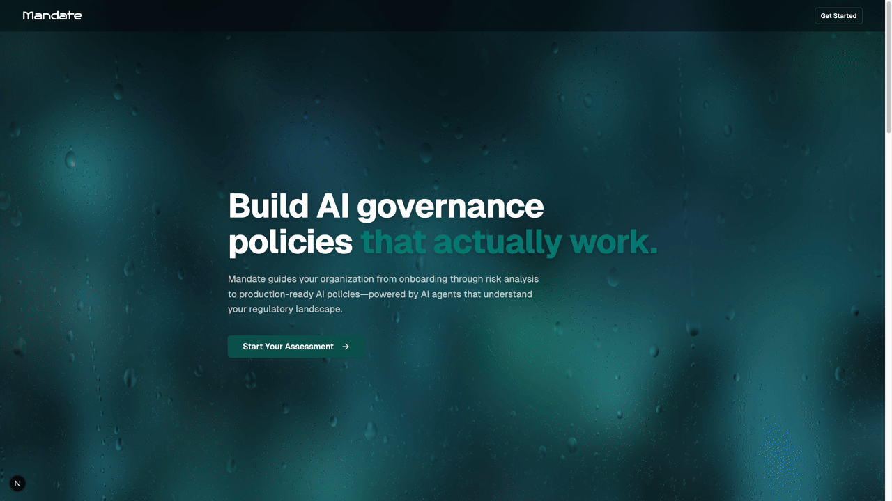

# Mandate

Mandate is a Turbo monorepo for generating AI governance policies from a guided company onboarding flow. Users complete a multi-step questionnaire, the app stores that company profile in Postgres via Prisma, then a LangGraph workflow asks follow-up questions, performs web research with Exa when needed, and produces final policy markdown.

## Demo



*Complete walkthrough: Homepage → Company Onboarding → AI-Powered Q&A → Policy Generation*

## How It Works

The active product flow lives in `apps/web`:

1. `/` routes users to onboarding.
2. `/onboarding` collects company details such as industry, size, operating regions, governance structure, and AI role.
3. A server action creates a `Company` record and starts a workflow thread.
4. `/dashboard` resumes that thread through streaming SSE events from `/api/mandate/stream`.
5. The graph runs stage 2, stage 3, stage 4, and `policy_generator`, pausing on LangGraph interrupts until enough information is available to generate final policies.

Intermediate draft sections are surfaced in the dashboard while the workflow is still running.

## Workspace Layout

- `apps/web`: Next.js App Router frontend, server actions, API routes, prompt assets
- `packages/agents`: LangGraph workflow, stage nodes, routers, model configuration, Exa search tool
- `packages/database`: Prisma schema, enums, database client
- `packages/ui`: shared React UI primitives
- `packages/eslint-config`, `packages/typescript-config`: shared tooling config

The main workflow code is under `packages/agents/src/mandate`.

## Prerequisites

- Node.js `>=18`
- npm `10.x`
- PostgreSQL database reachable through `DATABASE_URL`

Required environment variables:

```bash
DATABASE_URL=postgresql://...
EXASEARCH_API_KEY=...
GEMINI_API_KEY=...
OPENAI_API_KEY1=...
```

## Local Development

Install dependencies:

```bash
npm install
```

Generate Prisma client and sync the schema:

```bash
npm --workspace @repo/database run db:generate
npm --workspace @repo/database run db:push
```

Start the workspace:

```bash
npm run dev
```

To run only the web app:

```bash
npm --workspace web run dev
```

The app is served at `http://localhost:3000`.

## Common Commands

```bash
npm run build
npm run lint
npm run check-types
npm run format
```

Database helpers:

```bash
npm --workspace @repo/database run db:studio
```

## Notes for Contributors

- The live workflow uses `/api/mandate/stream`; `apps/web/app/api/chat/route.ts` appears to be older scaffold code.
- `packages/agents/src/graph.ts` is also scaffolded and not the main mandate graph.
- Prompt files used by the workflow are stored in `apps/web/public/prompts`.
- There is no committed automated test suite yet, so current verification is linting, type-checking, and manual end-to-end validation through onboarding and dashboard resume flows.
